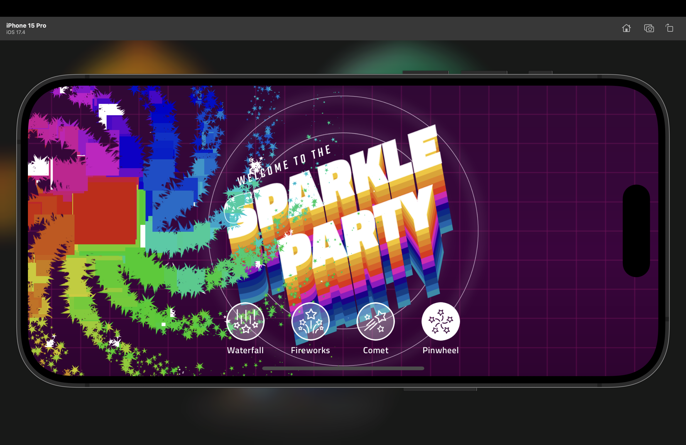
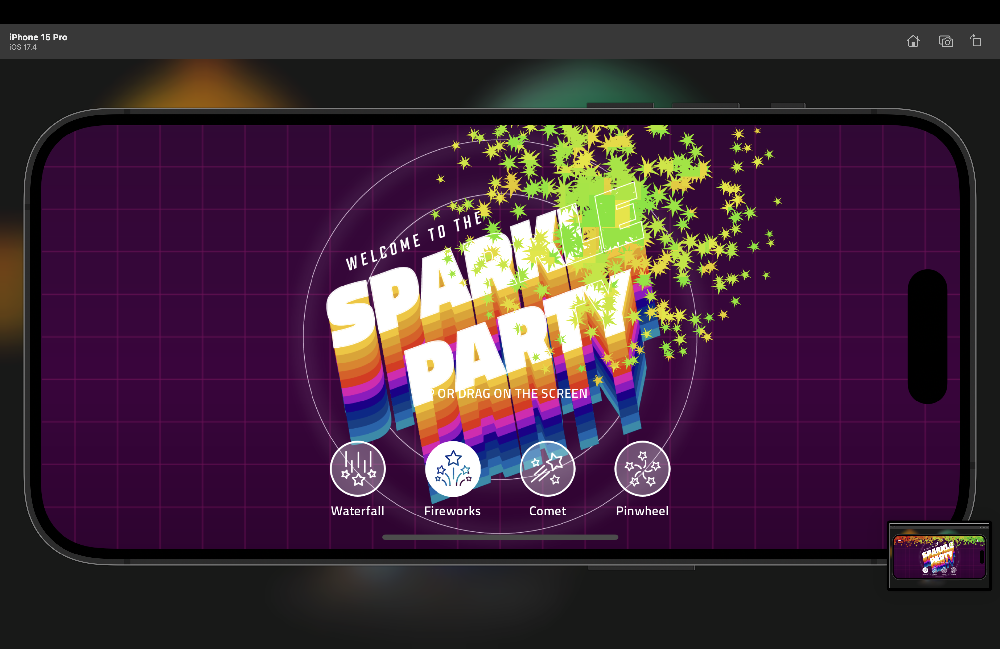
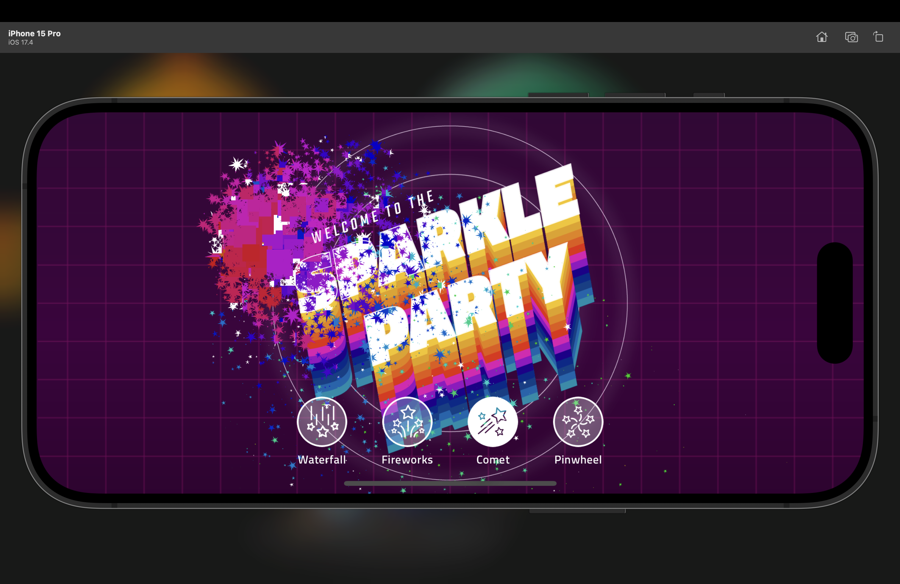
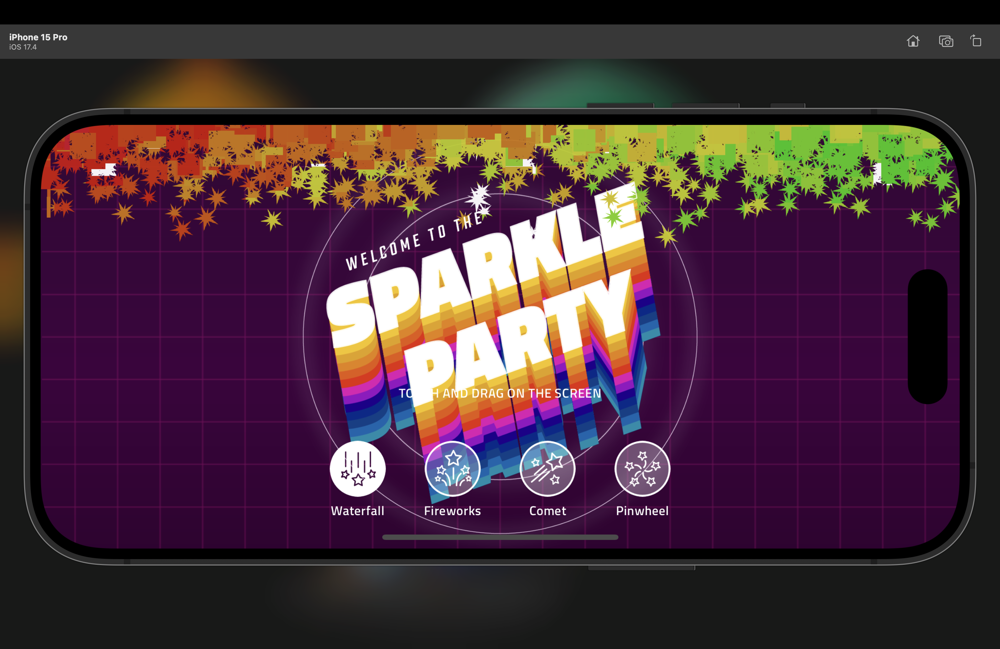

# flutter_sparkles

A new Flutter project.

## Getting Started

<table align="center" style="margin: 0px auto;">
  <tr>
    <td style="text-align: center;">
      

        
        
<a href="lib/particlefx/comet.dart" target="_blank">Comet</a>

      

    </td>
    <td style="text-align: center;">
      

        
        
<a href="lib/particlefx/fireworks.dart" target="_blank">Fire Works</a>

      

    </td>  
  </tr>
  <tr> 
  
  <td style="text-align: center;">
      

        
        
<a href="lib/particlefx/pinwheel.dart" target="_blank">Pin Wheel</a>

      

    </td>
    <td style="text-align: center;">
      

        
        
<a href="lib/particlefx/waterfall.dart" target="_blank">Waterfall</a>

      

    </td>
  </tr>
</table>
## Navigation Instructions

To view a particular image, click on the corresponding image above. This will open the image in your browser or image viewer.

To navigate to a specific file:
- For Windows users: Right-click on the image and select "Open link in new tab" to view the file directly.
- For macOS users: Control-click on the image and select "Open link in new tab" to view the file directly.

Alternatively, you can navigate to the `assets` folder in this repository and find the image file by its name.
